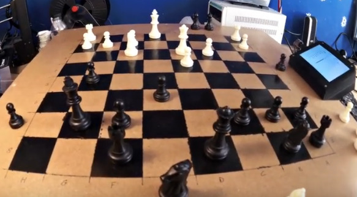
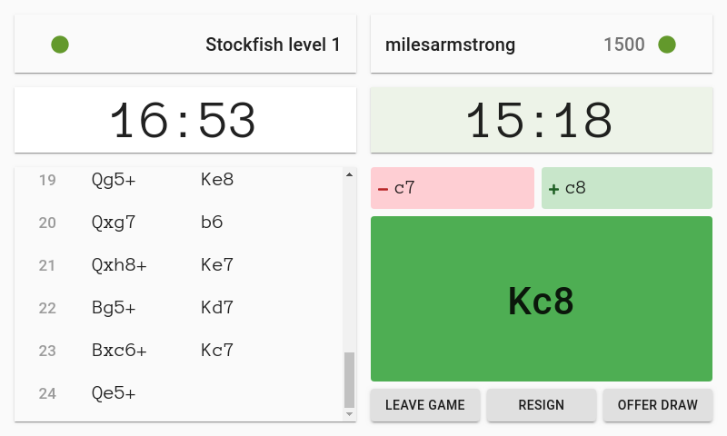
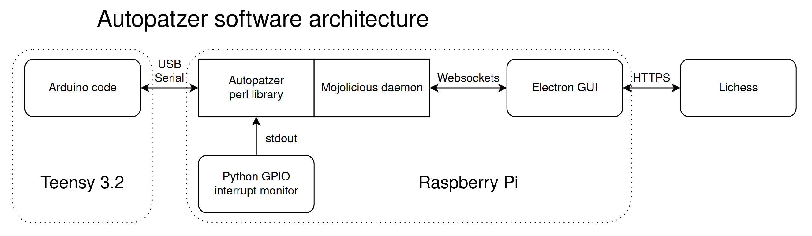

# autopatzer

An automatic chess board, supporting online play with people all over the world via the [Lichess Boards API](https://lichess.org/blog/XlRW5REAAB8AUJJ-/welcome-lichess-boards).

This repo contains FreeCAD files for the mechanical design, KiCad files for PCB design, Arduino code to run on
the microcontroller, Perl code for the library/program that interfaces with the controller, and JavaScript code for the
user interface and Lichess interface.

You can [watch a video of the board](https://www.youtube.com/watch?v=8ScFtkWvHW8) if you want.

## Build one yourself

I thoroughly encourage you to build an Autopatzer board. You'll need:

 - 3d printer
 - soldering skills
 - general DIY skills
 - and it would probably help to have prior experience with Arduino and Raspberry Pi

I currently have 4 spare PCBs so if you want one please just get in touch and tell me where to post it.

There aren't currently a decent set of instructions, so if you want to build one let's try and write some
instructions as you go so that it might be easier for whoever comes next!

There are some notes about how you might want to change the design in my blog post: https://incoherency.co.uk/blog/stories/autopatzer.html

## Architecture

There is a NEMA17 stepper motor for each of the X and Y axis, from an old 3d printer. The stepper motors are controlled by A4988 stepper
motor drivers, which are controlled using the step/direction pins, driven by the AccelStepper Arduino library. The electromagnet is switched
on and off with a MOSFET. The pieces are detected with an analogue hall effect sensor under each square. These 64 analogue signals are reduced
to 8 signals with 8x CD4051 8-to-1 analogue multiplexers. All of the code for this runs on a Teensy 3.2 microcontroller, and the rest is
adequately explained by this diagram:

## Contact

The Electron app providing the user interface is by Miles Armstrong: miles@milesarmstrong.co.uk

The rest is by James Stanley: james@incoherency.co.uk
